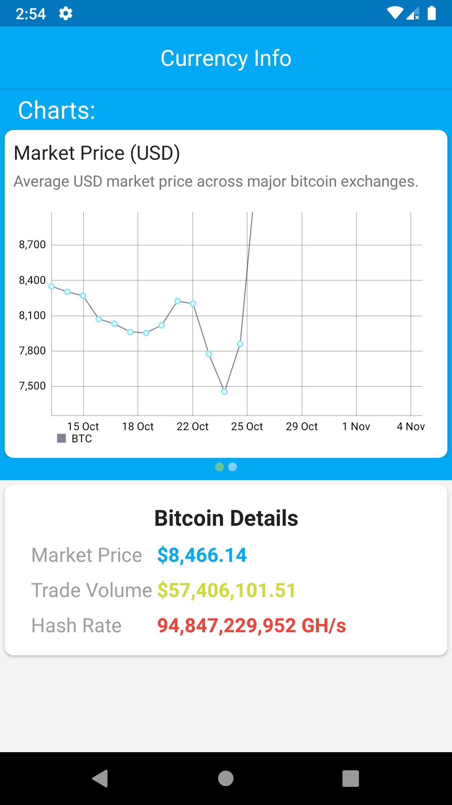

# BitcoinInfo App

A Bitcoin information app, with current exchange rate and charts Made in Kotlin and MVVM architecture.

# Libraries used:
- [RxJava](https://github.com/ReactiveX/RxJava)
- [Koin](https://insert-koin.io) for depencendy injections
- [Room](https://developer.android.com/jetpack/androidx/releases/room) database for offline support.
- [MPAndroidChart](https://github.com/PhilJay/MPAndroidChart) was used for charts.

# Test Cases are using:
 - [mockito-kotlin](https://github.com/nhaarman/mockito-kotlin)
 - [koin-test](https://insert-koin.io)
 - [espresso](https://developer.android.com/training/testing/espresso)

# Screenshots

